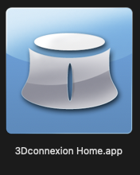
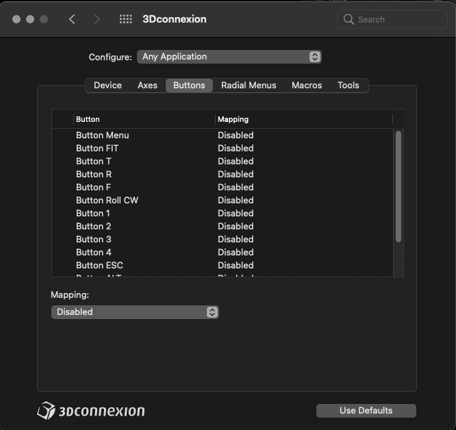

## MacOS Requirements and instructions

In order for this plugin to function on MacOS you'll need to install the official drivers from 3DConnexion like for any other software. The links are:

* [3DConnexion drivers](https://3dconnexion.com/uk/product/3dxware-10/) (for MacOS X 10.x)
* [BETA drivers for MacOS Big Sur 11.x](https://3dconnexion.com/uk/support/faq/beta-driver-for-macos-11-big-sur/) (as of 17.03.2021)

Once installed and restarted you will NEED to open the **3DConnexion Home** app. Before that the driver is not activated.

3DConnexion assigns their button mappings to the buttons on space mice by default. While this seems useful it actually interferes with the button assignment in Unreal Engine. To prevent that open the **Properties** from the 3DConnexion Home and while the **Any Application** is selected for the **Configure** dropdown menu, go to the **Buttons** tab and disable all the mappings, as seen on this screenshot:

